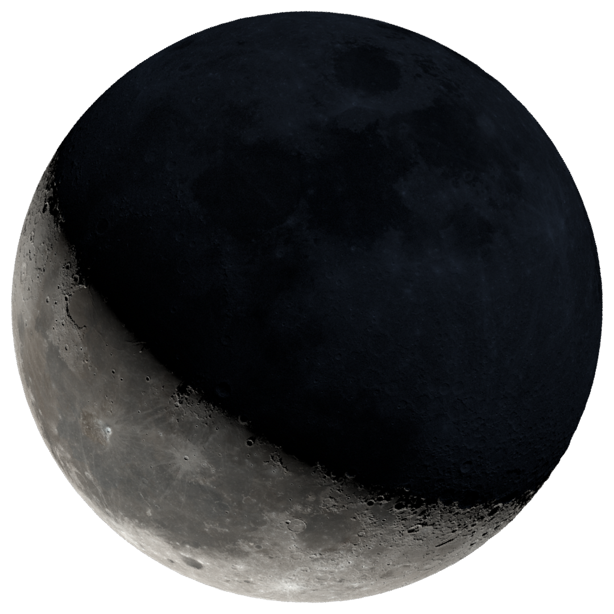

# LunarDelight

## Description
LunarDelight provides tools for creating moon-related images and videos (not yet) using Python. Explore and visualize the dance of the moon in various phases and perspectives through generated media.

## Installation
Ensure that you have Python 3 installed on your system. Follow the steps below to set up LunarDelight:

1. Clone the repository to your local machine.
   ```sh
   git clone https://github.com/dorjeduck/lunardelight.git
   ```
2. Navigate to the project directory.
   ```sh
   cd path/to/LunarDelight
   ```
3. Install the necessary dependencies.
   ```sh
   pip install -r requirements.txt
   ```
4. Download necessary moon images from NASA. (Note: This will download 883MB of images. If there is a problem during the download, simply re-run the script to continue downloading where it left off.)
   ```sh
   python download_nasa_imgs.py
   ```

## Usage
Generate an image of the current moon phase:
```sh
python moon.py
```

To explore various options and ways to specify the date for generating moon imagery, utilize the help command:

```sh
python moon.py -h
```

When you specify a location, LunarDelight ensures the moon's rotation is accurately depicted as it would appear from the given geographical point. 

### Example: Visualizing the Millennium Moon Over London

Generate an image of the moon as it appeared over London during the very first moments of the year 2000 using the following example:

```sh
python moon.py --date 2000-01-01 --location "51.5,-0.13" 
```

In this scenario, we're illustrating the moon precisely as it could be observed from London (latitude: 51.5072°, longitude: -0.1276°) during the transition into the new millennium.


<p align="center">
  
</p>


## License
LunarDelight is distributed under the MIT License. See `LICENSE` for more information.

## Acknowledgements
A heartfelt thank you to the following resources that make this project possible:

- NASA Moon Images: [NASA's official site](https://moon.nasa.gov/)
- Skyfield: [GitHub Repository](https://github.com/skyfielders/python-skyfield)

Stay tuned for more updates and features in LunarDelight!
