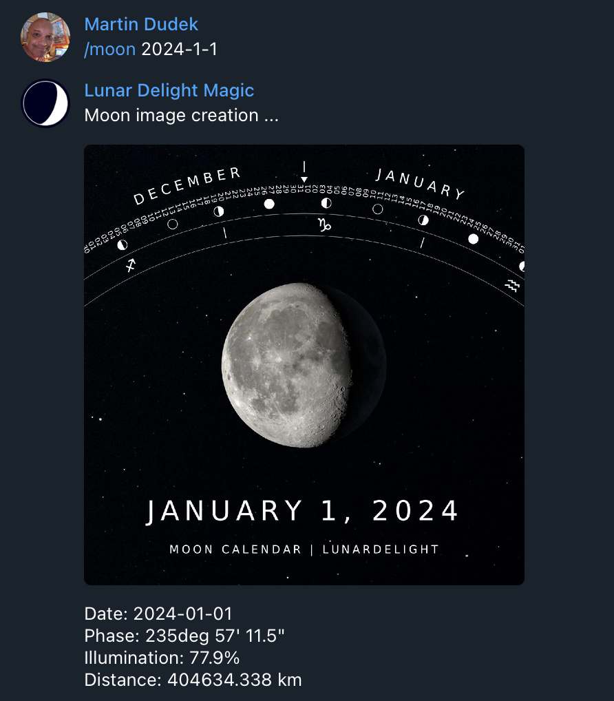

# Lunar Delight

## Description
LunarDelight provides tools for creating moon-related images using Python. This toolkit is still in its initial phase of development, but we anticipate adding new functionality as we progress.

## Installation
Ensure that you have Python 3 installed on your system. Follow the steps below to set up LunarDelight:

1. Clone the repository to your local machine.
   ```sh
   git clone https://github.com/dorjeduck/lunardelight.git
   ```
2. Navigate to the project directory.
   ```sh
   cd path/to/LunarDelight
   ```
3. Install the necessary dependencies.
   ```sh
   pip install -r requirements.txt
   ```
4. Download necessary moon images from NASA. (Note: This will download 883MB of images. If there is a problem during the download, simply re-run the script to continue downloading where it left off.)
   ```sh
   python download_nasa_imgs.py
   ```

## Usage
Generate an image of the current moon phase:
```sh
python moon.py
```

The script returns information about the moon at your specified time, encapsulating aspects like the moon phase, its distance from Earth, and the percentage of illumination. This information is returned in a structured JSON format, facilitating ease of data utilization and integration into various applications. Moreover, the JSON also includes the local path and filename corresponding to the dynamically generated image of the moon.

Example JSON output:

```json
{
  "phase": 323.65,
  "illumination": 9.86,
  "distance": 404537,
  "time": "2023-10-11 11:21:21 (UTC)",
  "json": "output/moon_2023-10-11_11:21:21.json",
  "image": "output/moon_2023-10-11_11:21:21.png"
}
```

To explore various options and ways to specify the date for generating moon imagery, utilize the help command:

```sh
python moon.py -h
```

Currently, LunarDelight accommodates time inputs exclusively in Coordinated Universal Time (UTC).

When you specify a location, LunarDelight ensures the moon's rotation is accurately depicted as it would appear from the given geographical point. 

### Example: Visualizing the Millennium Moon Over London

Generate an image of the moon as it appeared over London during the very first moments of the year 2000 using the following example:

```sh
python moon.py --date 2000-01-01 --location "51.5,-0.13" 
```

In this scenario, an image of the moon is generated as it could be observed from London (latitude: 51.5072°, longitude: -0.1276°) during the transition into the new millennium.

```json
{
  "phase": 297.43,
  "illumination": 27.17,
  "distance": 400897,
  "position_angle": 148.47,
  "latitude": 51.5,
  "longitude": -0.13,
  "time": "2000-01-01 00:00:00 (UTC)",
  "json": "output/moon_2000-01-01_00:00:00_51.500_-0.130.json",
  "image": "output/moon_2000-01-01_00:00:00_51.500_-0.130.png"
}
```

<p align="center">
  
</p>

## License
LunarDelight is distributed under the MIT License. See `LICENSE` for more information.

## Acknowledgements
A heartfelt thank you to the following resources that make this project possible:

- NASA Moon Images: [NASA's official site](https://moon.nasa.gov/)
- Skyfield: [GitHub Repository](https://github.com/skyfielders/python-skyfield)

Stay tuned for more updates and features in LunarDelight!

## LunarDelight on Social Media

LunarDelight is currently utilized by the following moon related social media accounts, where we share fascinating moon images, phases, and related content. Connect with us to stay updated with enchanting lunar visuals and insights:

- [Instagram](https://instagram.com/lunardelight)
- [Twitter](https://twitter.com/lunardelight)
- [Facebook](https://www.facebook.com/lunardelight)
- [Pinterest](https://www.pinterest.com/lunardelight/)
- [LinkedIn](https://www.linkedin.com/showcase/lunar-delight---moon-phase-calendar/posts/?feedView=all)

We invite you to follow, like, and share our celestial explorations across these platforms!

### See It in Action! 🚀

Experience our tool live by interacting with our **[@LunarDelightBot](https://t.me/LunarDelightBot)** on Telegram! 

<p align="center">
   
</p>


